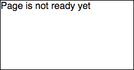
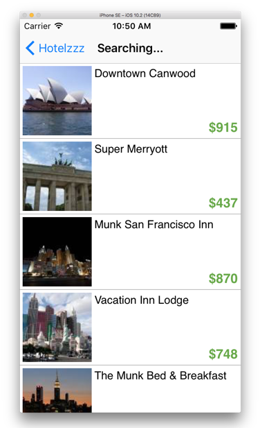

# Hotelzzz: Hipmunk iOS challenge

For this challenge, you will combine multiple technologies to make a hotel app.

## Setup

You'll need to run a server in a terminal, and an iOS app in the Xcode simulator.

### Web server

The server is a [create-react-app](https://github.com/facebookincubator/create-react-app) project, so it's pretty easy to get started.

```sh
cd server
npm install
npm start
```

A web browser will open for `http://localhost:3000`. The page will look like this:



### iOS client

You should be able to just open `Hotelzzz.xcworkspace` in Xcode and run it.

If you run the app, you'll see an ugly search form. If you tap "search," you should get to a bare-bones web view containing the page being served by `npm start`.

## The Challenge

### Part 1: iOS

The page served on `http://localhost:3000` has a JavaScript API. The app can control it by evaluating JS in the page (`webView.evaluateJavaScript()`).

The page also sends messages back to the web view using [WKWebView message handlers](https://developer.apple.com/reference/webkit/wkusercontentcontroller/1537172-add).

Your task is to:
* Figure out this API by reading the JavaScript source (start with `server/src/index.js`)
* Use the API to show a hotel search on the page
* When a hotel is selected in the web view, trigger the `hotel_details` segue in `SearchViewController`

**Suggestion:** Play with the page in a web browser before trying to add the app integration.

It will end up looking like this:



### Part 2: JS

The hotel list is pretty bare. Let's add some content to make it more appealing.

There's a hotel rating API: the function `fetchHotelRating(hotelID)` in `data.js` returns a promise.

Fetch a rating for each hotel and display it in the UI.

## Resources

* [NSHipster on WKWebView](http://nshipster.com/wkwebkit/)
* [Apple's WKWebView docs](https://developer.apple.com/reference/webkit/wkwebview)
* [React.js docs](https://facebook.github.io/react/docs/hello-world.html)